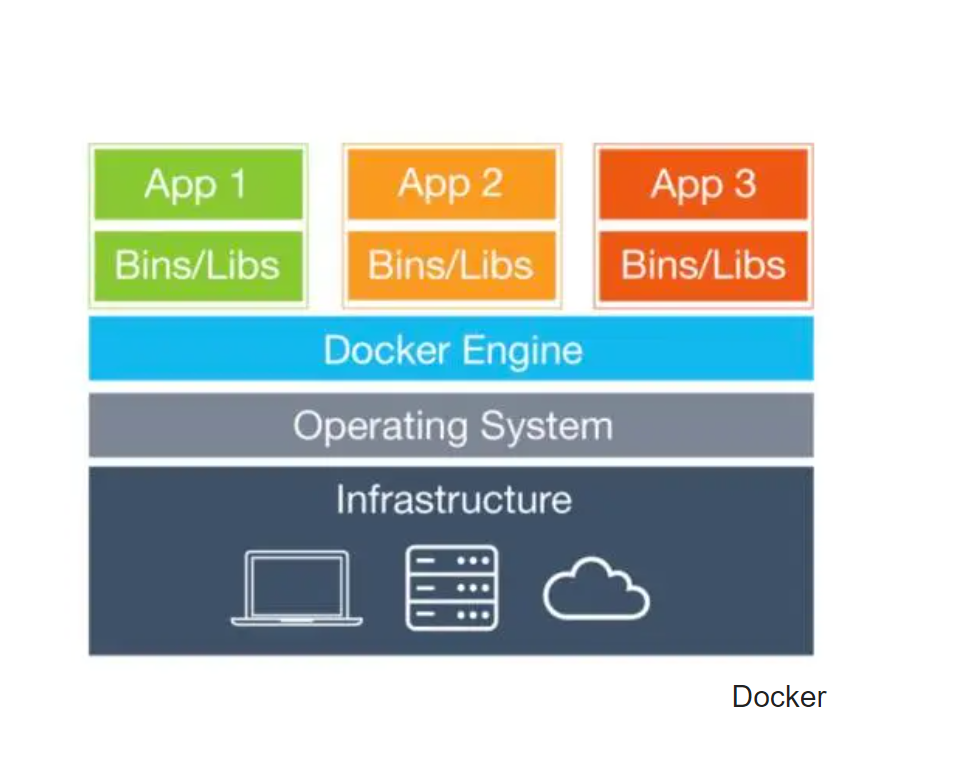
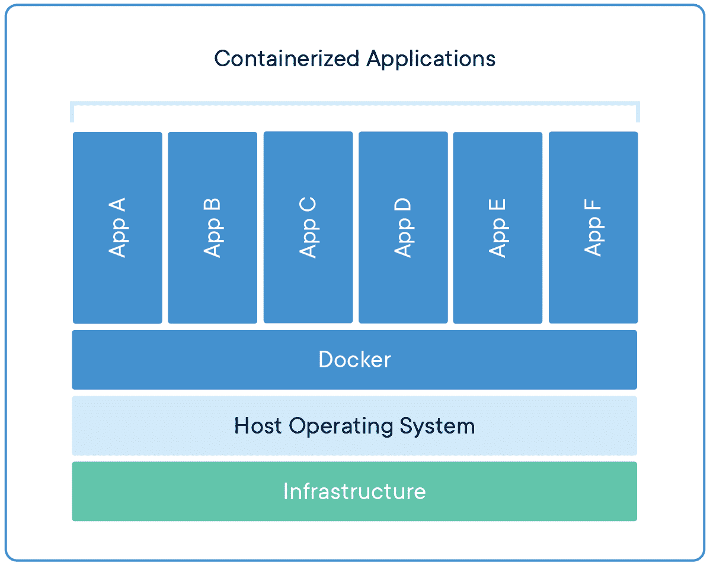

# Docker 



## Container 


## Container vs Virtual Machines


## Docker Commands

### List Images
```
docker image ls [OPTIONS] [REPOSITORY[:TAG]]
docker image ls

```
[Docker Image List Options](https://docs.docker.com/engine/reference/commandline/image_ls/)

### Docker Image Build
```
docker image build [OPTIONS] PATH | URL | -
docker image build -f Name of the Dockerfile (Default is 'PATH/Dockerfile')

```
[Docker Image Build Options](https://docs.docker.com/engine/reference/commandline/image_build/)

### Docker Image Pull
```
docker image pull [OPTIONS] NAME[:TAG|@DIGEST]
docker image pull python:latest
docker image pull postgress

```
[Docker Image Pull Options](https://docs.docker.com/engine/reference/commandline/image_pull/))

### Docker Image Remove
```
docker image rm [OPTIONS] IMAGE [IMAGE...]
docker image rm image id or image name
docker rmi image id or image name

```
[Docker Image Remove Options](https://docs.docker.com/engine/reference/commandline/image_pull/))

### List Containers
```
docker ps [OPTIONS]
docker ps

```
[Docker Container List Options](https://docs.docker.com/engine/reference/commandline/ps/)

### Docker Run Container
```
docker run [OPTIONS] IMAGE [COMMAND] [ARG...]
docker run 75993dd36176
```
[Docker Run Options](https://docs.docker.com/engine/reference/commandline/run/)

### Docker Stop Container
```
docker stop [OPTIONS] CONTAINER [CONTAINER...]
docker stop my_container

```
[Docker Run Options](https://docs.docker.com/engine/reference/commandline/stop/)

## Docker Network Commands

### List Networks
```
docker network ls [OPTIONS]
docker network ls

```
[Docker Network List Options](https://docs.docker.com/engine/reference/commandline/network_ls/)

### Create network
```
docker network create syntaxboard

```
[Docker Network Create Options](https://docs.docker.com/engine/reference/commandline/network_create/)

### Connect a running container to a network
```
docker network connect [OPTIONS] NETWORK CONTAINER
docker network connect "networkname" "containername"

```
[Docker Network Connect Options](https://docs.docker.com/engine/reference/commandline/network_connect/)


